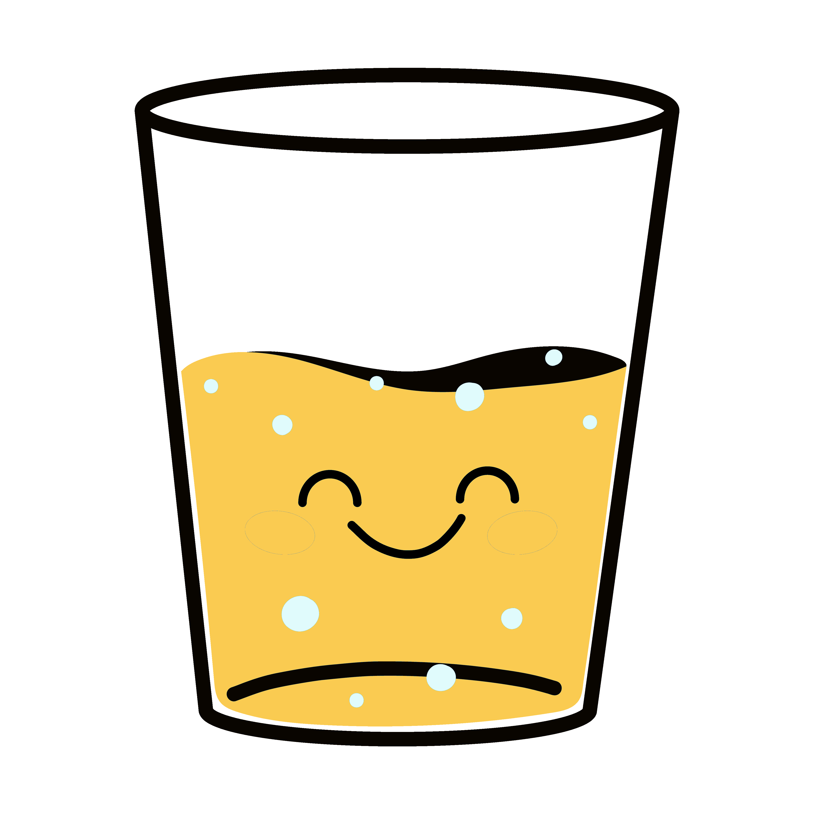
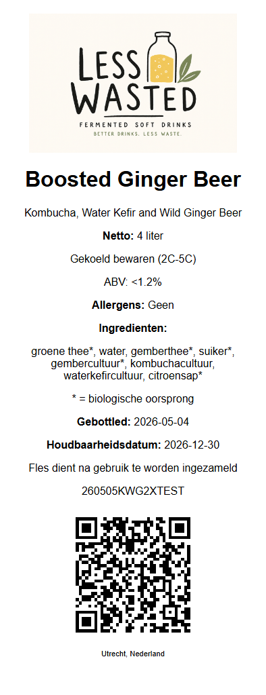

```{r, warning=FALSE, echo=FALSE,comment=FALSE,include=FALSE}

library(googlesheets4)
library(dplyr)

gs4_auth(email = "blaise@kello.co.uk")  # uses cached token, no browser

esc <- function(x) gsub("([*_])", "\\\\\\1", x)

r2 = googlesheets4::range_read(
  ss    = "https://docs.google.com/spreadsheets/d/1GVFj_OSiZubVkn9hrQ-vBN-LN7feuz3-H7hJaQMG8eA/edit?pli=1&gid=842588785#gid=842588785",
  sheet = "Recipes_F2",
  #range = "D2:D100",
  col_names = TRUE
) |> 
  filter(code == "KWG2B")

ingredients = paste0(r2$Ingredients,"<br>* = organically certified ingredient")
ingredienten = paste0(r2$Ingredienten,"<br>* = biologische oorsprong")


```

```{=html}
<style>
 
</style>
<div class="lw-section">

  <!-- ── how is it supplied ── -->
  <div class="drinks-section">
    <div class="drinks-title">Peely Spicy Water Kefir</div>
    <p class="brand-subtitle">Water kefir is a drink made using crystal like "grains", similar to the ginger beer plants traditionally used to make ginger beer.</p>

    <div class="step-card">
      
      <div class="step-desc">Ingredients: `r ingredients`.</div>
      
    </div>
  </div>

  <div class="tagline">Real drinks. No compromise.</div>
  <div class="tagline">get in touch: info@lesswasted.nl</div>

</div>
```